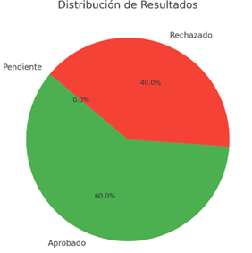
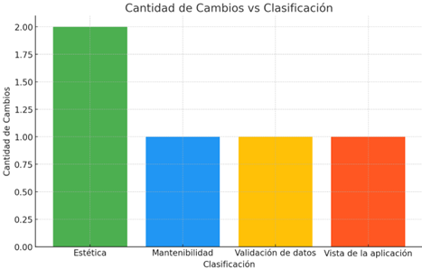
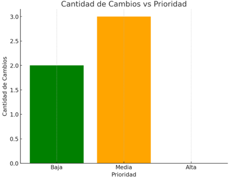

# Reporte de Cambios

**NOMBRE ESTUDIANTES:**  
Cristian Trávez, Lenin Rodriguez  

**FECHA:**  
12-08-2024  

---

## DESARROLLO

### a. Cantidad de cambios vs Acción  
**Datos:**
- **Aprobado:** 3  
- **Rechazado:** 2  
- **Pendiente:** 0  

**Gráfica:**  
_Tipo:_ Gráfico circular  

---

### b. Cantidad de cambios vs Clasificación  
**Datos:**
- **Estética:** 2  
- **Mantenibilidad:** 1  
- **Validación de datos:** 1  
- **Vista de la aplicación:** 1  

**Gráfica:**  
_Tipo:_ Gráfico de barras 

---

### c. Cantidad de cambios vs Prioridad  
**Datos:**
- **Baja:** 2  
- **Media:** 3  
- **Alta:** 0  

**Gráfica:**  
_Tipo:_ Gráfico de barras 

